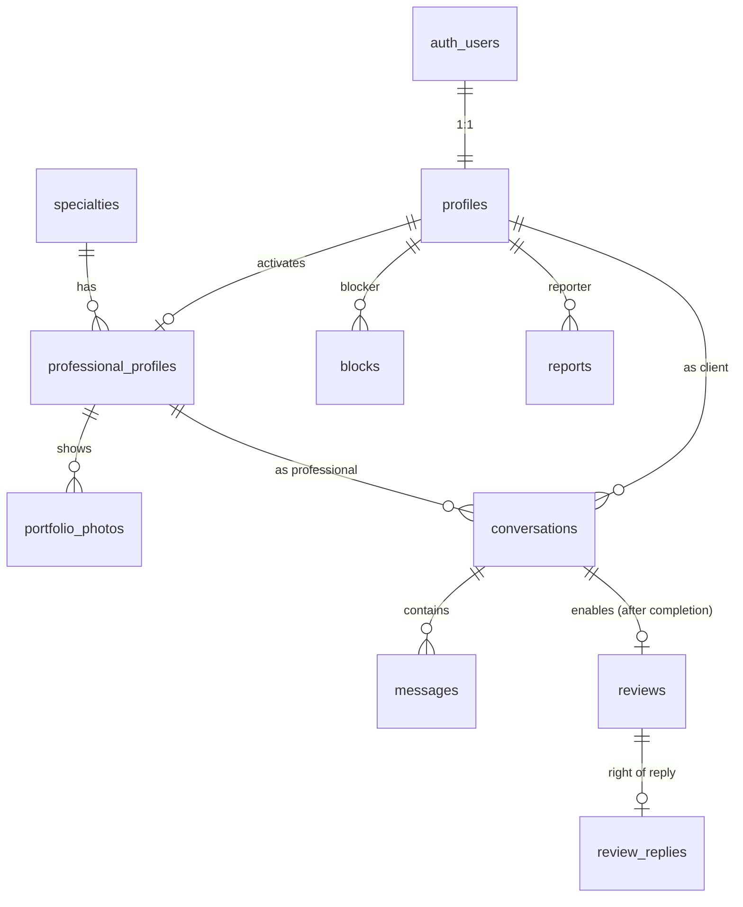

# HandyFEM — Data model (MVP)

**Status:** draft for review — written before the first migration
**Last updated:** 2026-06-11

This document maps the privacy table in [mvp-plan.md](mvp-plan.md) §3 to actual
tables and RLS policies. It is the contract every migration must honor.

---

## Design principles

1. **Table boundary = privacy boundary.** Postgres RLS is row-level, not
   column-level. So public and private data never share a table: everything in
   `professional_profiles` is publishable; everything personal stays in
   `profiles` or `auth.users`. If a new column doesn't match its table's
   visibility, it needs a new table.
2. **Random UUIDs for every ID** (`gen_random_uuid()`) — no auto-increment, no
   enumeration attacks (mvp-plan A01).
3. **No exact location, ever.** Work cities are a self-declared text array.
   No coordinates, no addresses, in any table (mvp-plan §3, §11).
4. **Contact data lives only in `auth.users`.** Email and phone are never
   duplicated into app tables, so no app query can leak them.
5. **Provider-agnostic images.** Store storage **paths/keys, never full URLs**
   — switching Supabase Storage ↔ Cloudflare R2 becomes a config change.
6. **RLS on every table from the migration that creates it**, tested with the
   negative case (CLAUDE.md workflow rule 0/1).
7. **Deletion is designed up front.** Every table declares what happens when
   the account is erased (GDPR right to be forgotten — real deletion, not a
   flag). See the deletion map at the end.

---

## Entity overview

---

## Tables

### `profiles` — base account (PRIVATE)

One row per user, created by trigger on `auth.users` signup. Base role is
client (Option C in mvp-plan §0).

| Column | Type | Notes |
|---|---|---|
| `id` | uuid PK | = `auth.users.id` |
| `display_name` | text | What counterparts see in chat |
| `avatar_path` | text nullable | Storage key, not URL |
| `pronouns` | text nullable | Optional, free text (mvp-plan §10) |
| `created_at` | timestamptz | |

**Access:** owner reads/updates own row; a user can read the `profiles` row of
someone they share a conversation with (needed to render chat). No anon access.

### `professional_profiles` — public storefront (100% PUBLIC when published)

Every column here is publishable by design (principle 1).

| Column | Type | Notes |
|---|---|---|
| `id` | uuid PK | |
| `profile_id` | uuid FK → profiles, UNIQUE | One professional profile per account |
| `slug` | text UNIQUE | Friendly URL: `maria-lopez-electricista-barcelona` |
| `specialty_id` | FK → specialties | |
| `professional_name` | text | The name she works under — not necessarily legal name |
| `bio` | text | |
| `rate_info` | text nullable | Free-text rates (no transactions in MVP) |
| `work_cities` | text[] | Self-declared, GIN index for directory filter |
| `is_published` | boolean default false | Draft until onboarding step 4 confirms |
| `verified` | boolean default false | Set manually in MVP (service role only) |
| `verified_at` | timestamptz nullable | |
| `created_at` | timestamptz | |

**Access:** anon/public SELECT where `is_published = true`; owner full CRUD on
own row **except** `verified`/`verified_at` (service role only — trust is not
self-granted); directory and profile pages read from here only.

### `specialties` — lookup

`id`, `name`, `slug`. Public read; writes via service role (seed migration).
Open question below on the initial list.

### `portfolio_photos`

| Column | Type | Notes |
|---|---|---|
| `id` | uuid PK | |
| `professional_id` | uuid FK → professional_profiles | ON DELETE CASCADE |
| `storage_path` | text | Key in the **public** images bucket |
| `position` | smallint | Display order |
| `created_at` | timestamptz | |

**Access:** public SELECT when parent profile is published; owner CRUD.
Upload constraints (MIME, ≤5MB, rename on store) enforced server-side at the
API route — see mvp-plan A08.

### `conversations`

One per client↔professional pair (`UNIQUE (client_id, professional_id)`).

| Column | Type | Notes |
|---|---|---|
| `id` | uuid PK | |
| `client_id` | uuid FK → profiles | |
| `professional_id` | uuid FK → professional_profiles | |
| `status` | enum | `inquiry` → `agreed` → `completed` (the "service status" in Spec 07) |
| `completed_by_client_at` | timestamptz nullable | Both-party completion |
| `completed_by_professional_at` | timestamptz nullable | confirmation (product-decisions) |
| `last_message_at` | timestamptz | For sorting the chat list |
| `created_at` | timestamptz | |

`status = 'completed'` only when **both** completion timestamps are set —
this is what unlocks a review. Hard to fake: requires both sides.

**Access:** participants only (client, or owner of the professional profile).
No anon, no third parties.

### `messages`

| Column | Type | Notes |
|---|---|---|
| `id` | uuid PK | |
| `conversation_id` | uuid FK → conversations | ON DELETE CASCADE |
| `sender_id` | uuid FK → profiles | |
| `body` | text | **Never logged** (mvp-plan A09) |
| `created_at` | timestamptz | |
| `read_at` | timestamptz nullable | |

**Access:** SELECT for conversation participants. INSERT only if sender is a
participant **and no block exists in either direction** between the
participants — the block check lives in the RLS policy itself, not only in UI.

### `blocks`

| Column | Type | Notes |
|---|---|---|
| `blocker_id` | uuid FK → profiles | PK (blocker_id, blocked_id) |
| `blocked_id` | uuid FK → profiles | |
| `created_at` | timestamptz | |

**Access — the subtle one:** SELECT/INSERT/DELETE only where
`blocker_id = auth.uid()`. The blocked party can **never** read these rows —
that's how "without the blocked party knowing" (mvp-plan §3) is enforced at
the database level. The effect is bidirectional (messages INSERT policy checks
both directions); the knowledge is one-directional.

### `reports`

| Column | Type | Notes |
|---|---|---|
| `id` | uuid PK | |
| `reporter_id` | uuid FK → profiles | |
| `reported_profile_id` | uuid FK → profiles | |
| `category` | enum | `harassment` \| `inappropriate_content` \| `fraud` \| `impersonation` |
| `message_id` | uuid FK nullable | Optional evidence pointer |
| `details` | text nullable | |
| `status` | enum default `open` | `open` \| `resolved` |
| `created_at` | timestamptz | |

**Access:** INSERT by reporter; SELECT own reports only; everything else is
moderation = service role (founder via email in MVP — the email send is a
server-side effect on insert, e.g. DB webhook → API route → Resend).

### `reviews` — client → professional (added to MVP 2026-06-11)

| Column | Type | Notes |
|---|---|---|
| `id` | uuid PK | |
| `conversation_id` | uuid FK → conversations, UNIQUE | One review per completed service |
| `author_id` | uuid FK → profiles | The client |
| `professional_id` | uuid FK → professional_profiles | Denormalized for the public profile query |
| `rating` | smallint CHECK 1–5 | |
| `body` | text nullable | |
| `created_at` | timestamptz | |

**Access:** public SELECT (they appear on the public profile). INSERT only
when: author is the conversation's client AND the conversation is `completed`
(both timestamps set) — the gate is an EXISTS check inside the RLS policy.
No UPDATE/DELETE by users in MVP (moderation via report → service role).

### `review_replies` — right of reply

Separate table (principle 1: the professional may write **only** the reply,
and RLS can't restrict single columns).

`id`, `review_id` FK UNIQUE, `professional_id` FK, `body`, `created_at`.
Public SELECT; INSERT only by the reviewed professional; one per review.

### Ratings aggregate

No stored counters in MVP. A SQL view `professional_ratings`
(`professional_id`, `avg_rating`, `review_count`) computed from `reviews` —
correct by construction, no sync bugs. Optimize later if the directory needs it.

---

## Access matrix (summary)

| Table | anon | any logged-in | owner | counterpart | service role |
|---|---|---|---|---|---|
| profiles | — | — | R/W own | R (shared conversation) | all |
| professional_profiles | R (published) | R (published) | R/W own (not `verified`) | — | all |
| specialties | R | R | — | — | W |
| portfolio_photos | R (published) | R (published) | CRUD own | — | all |
| conversations | — | — | R/W participant | R/W participant | all |
| messages | — | — | R + INSERT (no block) | R | all |
| blocks | — | — | CRUD own (as blocker) | **never** | all |
| reports | — | INSERT; R own | — | — | all (moderation) |
| reviews | R | R | INSERT (completed convo) | — | all |
| review_replies | R | R | INSERT (own review's professional) | — | all |

Every cell marked "—" is a **negative test** in the RLS test script.

---

## Migration order (matches the vertical slices)

1. **Auth slice:** `profiles` + signup trigger. ⚠️ First migration → create
   the RLS test harness here (CLAUDE.md workflow rule 0).
2. **Onboarding/profile slice:** `specialties` (+ seed), `professional_profiles`,
   `portfolio_photos` + the public images bucket.
3. **Directory slice:** no new tables — indexes only (`specialty_id`,
   GIN on `work_cities`, `is_published`).
4. **Chat & safety slice:** `conversations`, `messages`, `blocks`, `reports`
   (+ moderation email hook). Blocks and reports ship **with** chat, not after.
5. **Reviews slice:** `reviews`, `review_replies`, `professional_ratings` view.

---

## Deletion map (right to be forgotten)

When an account is erased (real deletion script, mvp-plan §3):

| Table | Behavior |
|---|---|
| profiles, professional_profiles, portfolio_photos | DELETE (cascade) + storage objects removed |
| conversations, messages | DELETE the user's messages; conversation rows with both parties' references removed. Counterpart's chat shows "deleted account" placeholder client-side |
| blocks | DELETE rows in both directions |
| reports | Keep (legal/safety record) but anonymize `reporter_id` if the reporter is the one deleting |
| reviews | Decide at implementation: delete vs anonymize author ("former client"). Anonymizing preserves the professional's earned reputation — leaning anonymize, confirm with GDPR guidance |

---

## Open questions

1. **Professional → client ratings.** mvp-plan §11 promises the professional
   can see a client's history "ratings from previous professionals" before
   accepting a job. That's a second review direction (visible only to
   professionals, never public) and is **not** covered by the `reviews` table
   above. Decide: in MVP (extra table + flow) or soften §11 for v1.
2. **Specialty seed list.** Which trades exactly, and in which form (the list
   in mvp-plan line 3 is a start). Needed before the onboarding slice.
3. **Storage provider** — R2 vs Supabase Storage (tracked in
   product-decisions.md). Schema is unaffected thanks to principle 5.
4. **Moderation email mechanism** for reports: Supabase DB webhook vs doing it
   in the API route that creates the report. Decide in the chat & safety slice.
